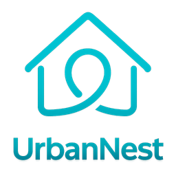

<div align="center">



# UrbanNest

**A full-stack property rental platform that connects property owners with tenants.**

Browse and compare homes, request bookings, leave reviews, rate owners and tenants, and manage everything from a role-based dashboard.

[](https://github.com/UtshaBasak/UrbanNest/actions/workflows/ci.yml)
[](https://github.com/UtshaBasak/UrbanNest/actions/workflows/codeql.yml)


</div>

---

## Table of Contents

- [Features](#features)
- [Tech Stack](#tech-stack)
- [Project Structure](#project-structure)
- [Getting Started](#getting-started)
- [Environment Variables](#environment-variables)
- [Available Scripts](#available-scripts)
- [API Overview](#api-overview)
- [Security](#security)
- [Deployment](#deployment)
- [Contributing](#contributing)
- [Author](#author)

## Features

### For tenants
- **Discover properties.** Search and filter listings by location, price, type, bedrooms and more. See top-rated and personalised suggested listings.
- **Compare side by side.** Put two properties next to each other before you decide.
- **Favourites.** Save properties and owners to come back to later.
- **Bookings.** Send booking requests, track their status, and cancel them.
- **Leave requests.** Ask to end an active tenancy and see the owner's decision.
- **Reviews and ratings.** Review properties you have stayed in and rate owners.

### For owners
- **Manage listings.** Create, edit and remove property listings with images and amenities.
- **Handle bookings.** Approve or reject booking requests, with an optional reason.
- **Decide on leave requests.** Set an end condition: immediately, end of month, end of booking, or end of next month.
- **Tenant reputation.** Rate tenants. A tenant's contact details become visible only after they complete a booking with you.

### For administrators
- **Admin dashboard.** View platform-wide statistics.
- **Moderation.** Manage owners, tenants, properties and reviews. Deleting a user also removes all of their related data.

### Platform
- Cookie-based JWT authentication (HTTP-only cookies) with role-based access control: `tenant`, `owner`, `admin`
- In-app notifications for booking and leave-request activity, which can be marked read or unread
- A user directory with public profiles and rating summaries
- Light and dark themes, and a responsive Tailwind CSS interface

## Tech Stack

| Layer      | Technology |
|------------|------------|
| Frontend   | React 19, React Router 7, Vite 8, Tailwind CSS 4, Lucide icons |
| Backend    | Node.js, Express 5, Mongoose 9 |
| Database   | MongoDB (replica set / Atlas, which transactions require) |
| Auth       | JSON Web Tokens in HTTP-only cookies, bcrypt password hashing |
| Security   | Helmet, CORS allow-list, express-rate-limit, express-validator |
| Tooling    | Nodemon, Concurrently, GitHub Actions (CI and CodeQL), Dependabot |

## Project Structure

```
UrbanNest/
├── backend/                  # Express REST API
│   ├── config/               # Environment loading and database connection
│   ├── controllers/          # Route handlers (business logic)
│   ├── middleware/           # Authentication and authorisation
│   ├── models/               # Mongoose schemas
│   ├── routes/               # API route definitions
│   ├── scripts/              # One-off maintenance scripts (admin seeding, migrations)
│   ├── utils/                # Shared helpers (e.g. cascading deletes)
│   ├── .env.example
│   └── server.js             # App entry point
├── frontend/                 # React single-page app
│   ├── public/               # Static assets
│   ├── src/
│   │   ├── components/       # Reusable UI components
│   │   ├── context/          # Auth and theme providers
│   │   ├── pages/            # Route-level pages
│   │   ├── utils/            # API client and HTTP helpers
│   │   ├── App.jsx           # Routes
│   │   └── main.jsx          # Entry point
│   ├── .env.example
│   └── vite.config.js
├── .github/                  # CI, CodeQL and Dependabot configuration
└── package.json              # Root scripts that run both apps together
```

## Getting Started

### Prerequisites

- [Node.js](https://nodejs.org/) 22 or newer
- A MongoDB database. A free [MongoDB Atlas](https://www.mongodb.com/atlas) cluster is the easiest option. Account deletion uses multi-document transactions, which need a replica set; Atlas provides one by default.

### 1. Clone the repository

```bash
git clone https://github.com/UtshaBasak/UrbanNest.git
cd UrbanNest
```

### 2. Install dependencies

```bash
npm run install:all
```

This installs the root, `backend` and `frontend` dependencies.

### 3. Configure environment variables

```bash
cp backend/.env.example backend/.env
```

Open `backend/.env` and set at least `MONGO_URI` and `JWT_SECRET`. See [Environment Variables](#environment-variables).

### 4. (Optional) Create an admin account

Set `ADMIN_EMAIL` and `ADMIN_PASSWORD` in `backend/.env`, then run:

```bash
npm run create-admin
```

### 5. Start the development servers

```bash
npm run dev
```

| Service  | URL                          |
|----------|------------------------------|
| Frontend | http://localhost:5173        |
| API      | http://localhost:5000/api    |
| Health   | http://localhost:5000/api/health |

In development, the Vite dev server proxies `/api` requests to the backend, so you don't need any CORS configuration.

## Environment Variables

### Backend (`backend/.env`)

| Variable           | Required | Default        | Description |
|--------------------|:--------:|----------------|-------------|
| `MONGO_URI`        | ✅       | –              | MongoDB connection string |
| `JWT_SECRET`       | ✅       | –              | Secret used to sign auth tokens. Use a long random string. |
| `PORT`             |          | `5000`         | Port the API listens on |
| `NODE_ENV`         |          | `development`  | `development` or `production` |
| `CLIENT_URL`       |          | –              | Allowed frontend origin(s), comma-separated |
| `COOKIE_SAME_SITE` |          | `strict`       | `strict`, `lax` or `none`. Use `none` when the frontend and API are on different domains. |
| `ADMIN_NAME`       |          | `Admin User`   | Name for the seeded admin |
| `ADMIN_EMAIL`      |          | `admin@gmail.com` | Email of the admin account |
| `ADMIN_PASSWORD`   | for seeding | –           | Password for a newly created admin |
| `ADMIN_PHONE`      |          | `+1234567890`  | Phone number for the seeded admin |

> For backwards compatibility, a `.env` file in the project root is also loaded as a fallback.

### Frontend (`frontend/.env`)

| Variable            | Default                 | Description |
|---------------------|-------------------------|-------------|
| `VITE_API_URL`      | `/api`                  | API base URL used by the production build |
| `VITE_PROXY_TARGET` | `http://localhost:5000` | Backend address for the dev-server proxy |

## Available Scripts

Run these from the project root:

| Command                 | Description |
|-------------------------|-------------|
| `npm run install:all`   | Install dependencies for the root, backend and frontend |
| `npm run dev`           | Run the API and the web app together with hot reload |
| `npm run dev:backend`   | Run only the API (nodemon) |
| `npm run dev:frontend`  | Run only the web app (Vite) |
| `npm run build`         | Build the frontend for production (`frontend/dist`) |
| `npm start`             | Start the API in production mode |
| `npm run create-admin`  | Create or promote the admin account |

Backend-only: `npm run migrate:property-ids --prefix backend` assigns public property IDs to older listings.

## API Overview

All endpoints are prefixed with `/api`. Protected routes need the `token` cookie that login and register set.

| Resource          | Base path              | Highlights |
|-------------------|------------------------|------------|
| Auth              | `/auth`                | `POST /register`, `POST /login`, `POST /logout`, `GET/PUT/DELETE /me` |
| Properties        | `/properties`          | List and filter, `top-rated`, `suggested`, by owner, CRUD (owner/admin) |
| Bookings          | `/bookings`            | Create (tenant), `GET /my`, approve/reject (owner), cancel, delete |
| Reviews           | `/reviews`             | Property reviews, `my`, `my-properties`, eligibility check |
| Ratings           | `/ratings`             | Rate owners and tenants, summaries, eligibility check |
| Users             | `/users`               | Directory, search, profiles, favourites, contact visibility |
| Notifications     | `/notifications`       | List, mark read/unread (single or all), delete |
| Leave requests    | `/leave-requests`      | Create (tenant), list, decide (owner/admin) |
| Admin             | `/admin`               | Stats, owners, tenants, properties, reviews, deletions |
| Health            | `/health`              | Service health check |

## Security

- Passwords are hashed with bcrypt (12 salt rounds) and never returned by the API.
- Auth tokens are stored in **HTTP-only** cookies, so page scripts cannot read them.
- `helmet` sets security headers, the CORS allow-list restricts origins in production, and auth routes are rate-limited.
- Request bodies are validated with `express-validator`.
- Public registration can only create `tenant` or `owner` accounts. Admin accounts are created through `npm run create-admin`.
- CodeQL scans run on every push, and Dependabot keeps dependencies up to date.

## Deployment

UrbanNest can run on any Node host. A typical setup on [Render](https://render.com/):

1. **API (Web Service).** Root directory `backend`, build command `npm install`, start command `npm start`. Set `NODE_ENV=production`, `MONGO_URI`, `JWT_SECRET` and `CLIENT_URL`.
2. **Frontend (Static Site).** Root directory `frontend`, build command `npm install && npm run build`, publish directory `dist`.
   - **Same-origin setup (recommended):** add a rewrite rule that sends `/api/*` to the API service, and a catch-all rule that sends `/*` to `/index.html` for client-side routing.
   - **Cross-origin setup:** set `VITE_API_URL` to the API URL, and set `COOKIE_SAME_SITE=none` on the API.

## Contributing

Contributions, issues and feature requests are welcome.

1. Fork the repository.
2. Create a feature branch: `git checkout -b feature/amazing-feature`.
3. Commit your changes: `git commit -m "Add amazing feature"`.
4. Push the branch: `git push origin feature/amazing-feature`.
5. Open a pull request.

## Author

**Utsha Basak**: [@UtshaBasak](https://github.com/UtshaBasak)

If you find this project useful, consider giving it a ⭐ on GitHub.
